<div align="center">

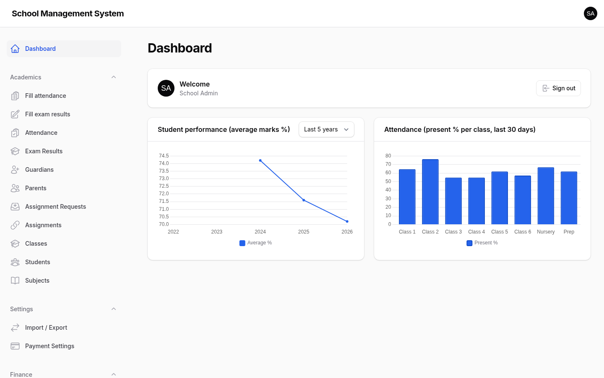
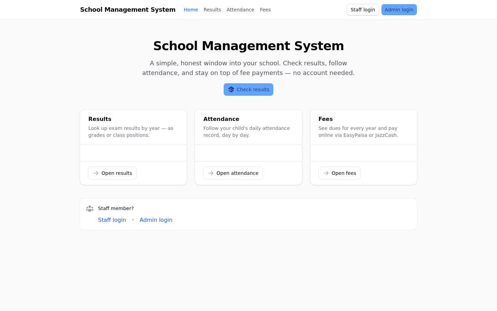

</div>

# School Management System

### A complete school platform for admins, teachers, and parents — with a public portal that needs no account at all

[](https://laravel.com)
[](https://www.php.net)
[](https://filamentphp.com)
[](https://livewire.laravel)
[](#testing)
[](LICENSE)

Built on [Laravel](https://laravel.com), [Livewire](https://livewire.laravel), and
[Filament v5](https://filamentphp.com) — two role-separated panels plus a public
registry portal. Every custom view is composed from Filament components so all
pages share one design system, and nothing is ever deleted: records are archived
by status change, enforced in policies, models, and UI alike.

## Screenshots

| Fill attendance — a whole class at once | Fill exam results — marks per class |
| --- | --- |
| 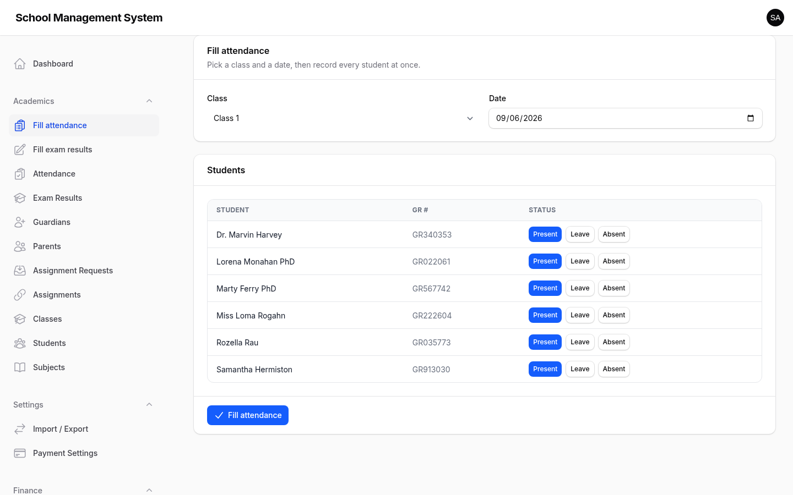 | 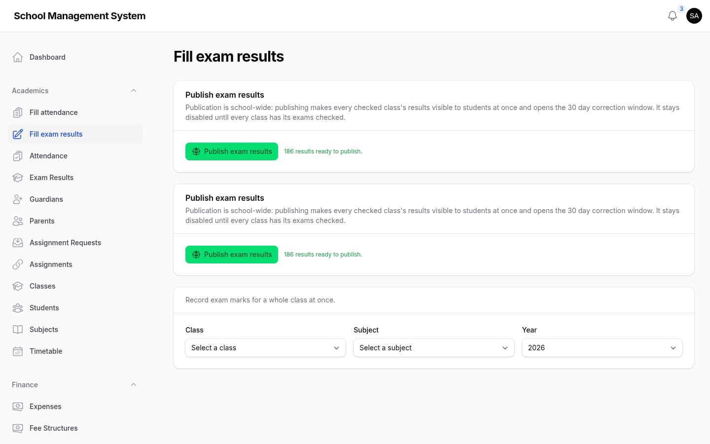 |

| Students — GR #, class, parents | Classes — assign subjects inline |
| --- | --- |
| 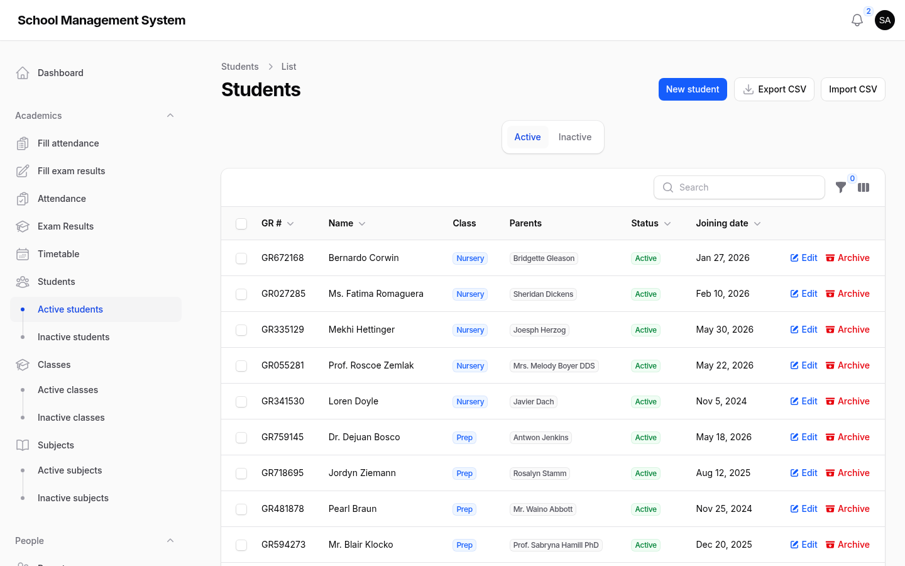 | 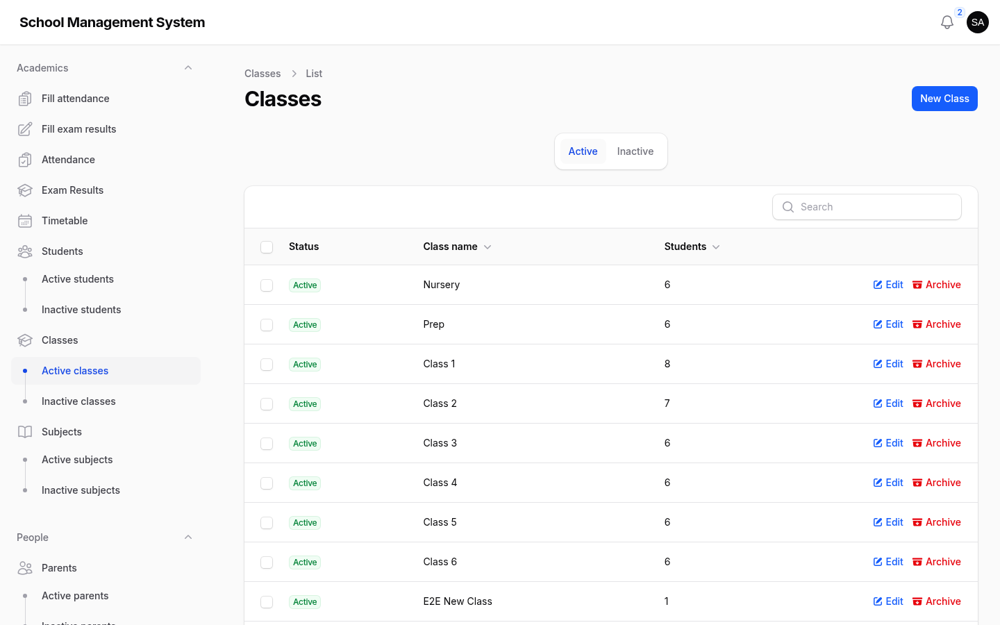 |

| Parents — link children with one select | Import / Export — CSV in, CSV out |
| --- | --- |
| 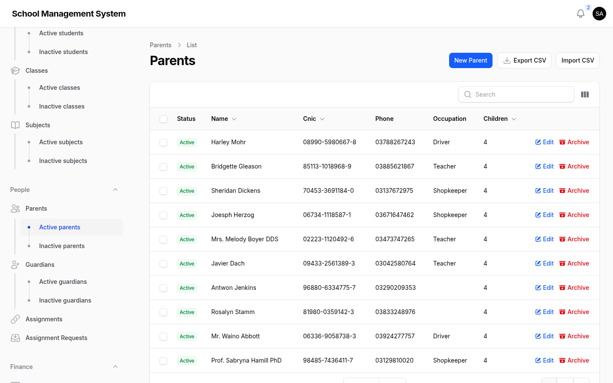 | 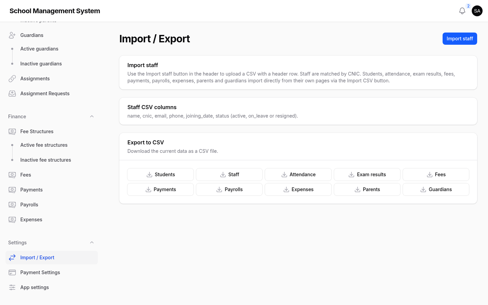 |

| Teacher workspace, scoped to assignments | Public fees with online payment |
| --- | --- |
| 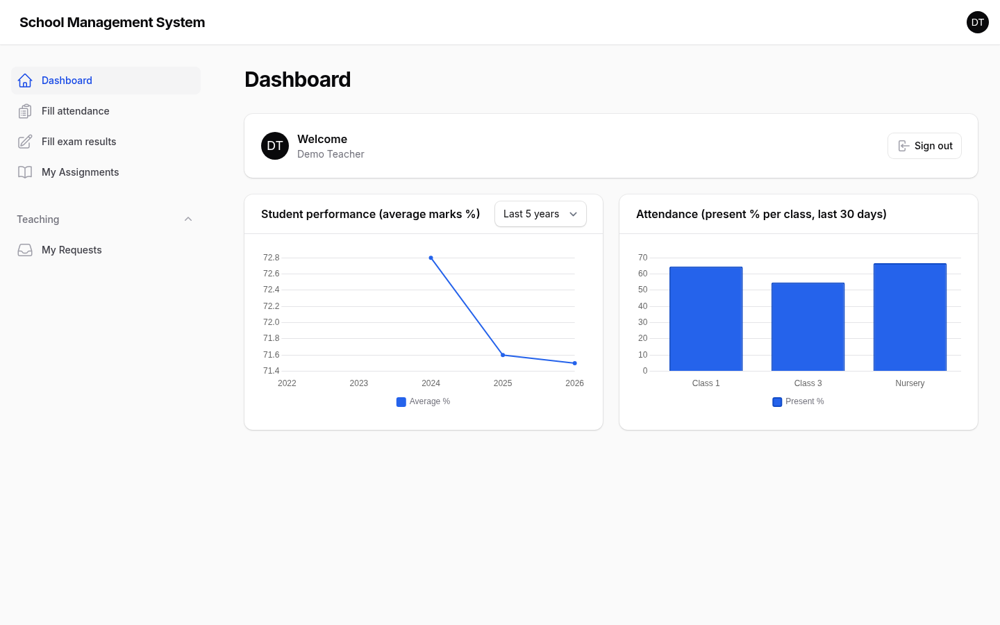 | 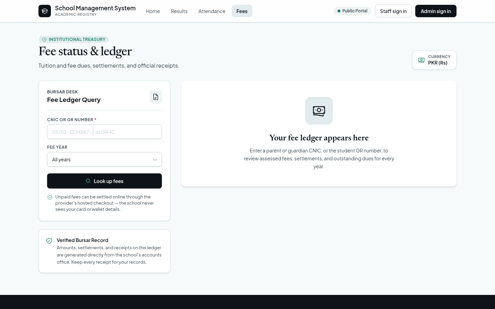 |

| Public results lookup | Payment settings — encrypted gateway config |
| --- | --- |
| 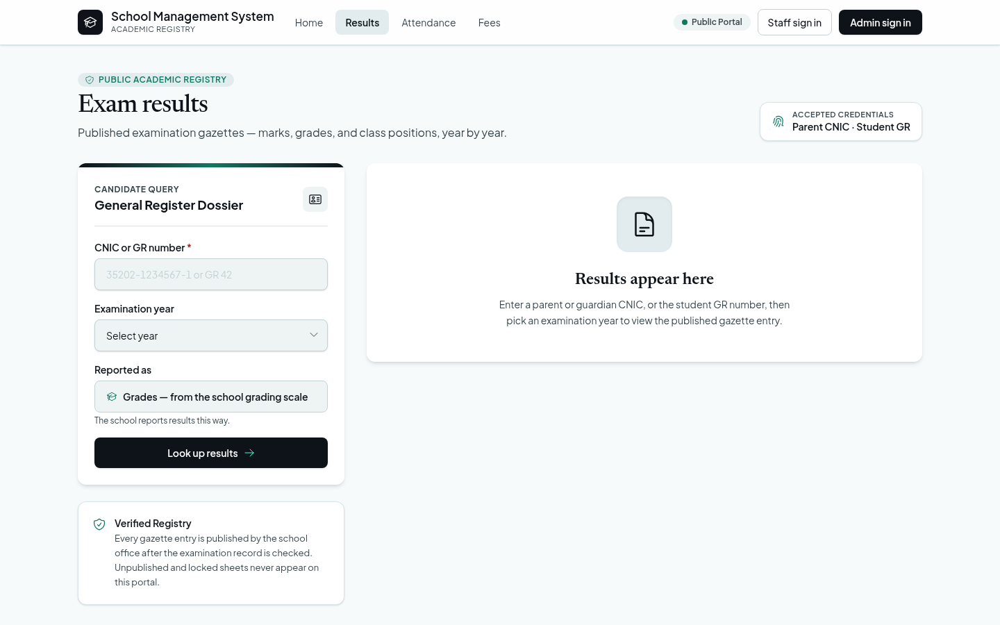 | 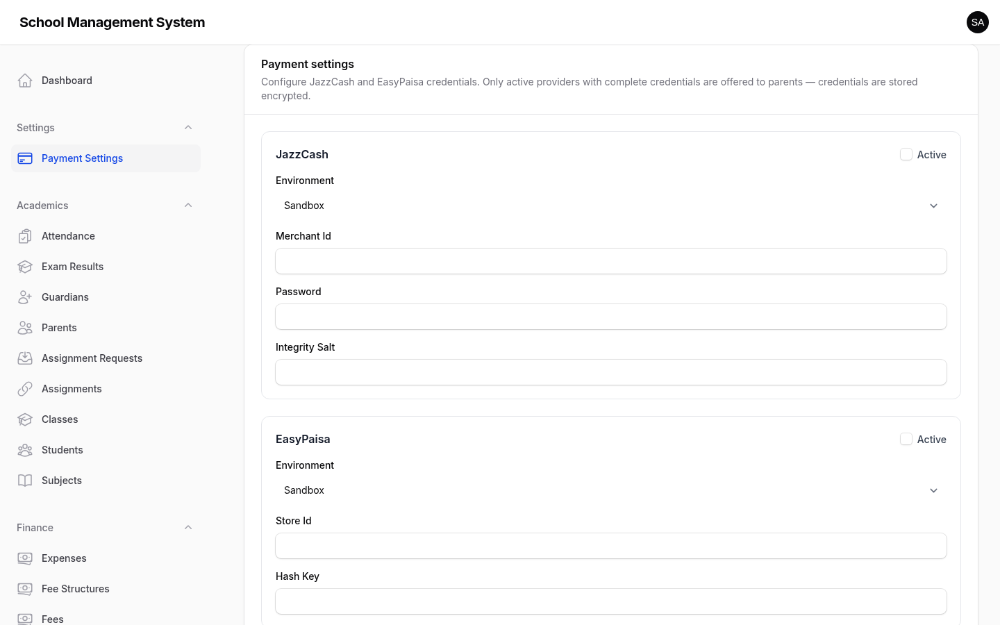 |

## Surfaces

| Who | Where | What |
| --- | --- | --- |
| Admins | `/dashboard` | Full control: academics, people, finance, HR, settings |
| Teachers | `/staff` | A focused workspace scoped to their own assignments |
| Parents | `/` | Public lookups for results, attendance, and fees — no login |

Every create/edit form is a **step-by-step wizard** whose submit buttons appear
only on the final step. Attendance and exam results are entered as a **whole
class in one table**, and every dataset moves in and out through the built-in
**CSV import / export** page.

## Features

**Academics**
- Classes, subjects, and students identified by a single **GR #**
- Student profiles created through a wizard; parents and guardians linked as relations, never duplicated
- Class ↔ subject assignment from both directions, with inline create
- Staff assignments (subject × class) and a change-request workflow
- Timetable builder with conflict detection — a class can't be double-booked and neither can a teacher

**Attendance**
- Whole-class attendance entry on one screen (admin and teacher pages); clicks are instant and local, one write on submit
- Status buttons speak in colour: red for absent, yellow for sanctioned leave
- Automated 8:20 AM deadline check — admins are notified when attendance is missing

**Exams**
- Exam results per year and exam type with automatic grades and class positions
- School-wide publishing workflow: publish all classes at once, 30-day correction window, then records lock
- Five-year performance analytics on the dashboard

**Finance**
- Fee structures, per-student fees, and partial payments
- Online payments via **EasyPaisa** and **JazzCash** with sandbox/live environments, encrypted credentials, and official receipts
- Payroll and expense tracking with daily, weekly, monthly, yearly, or one-time recurrence (admin only)
- Optional **monthly school progress stats**: income from completed payments, estimated spending and the net result, charted over the last 12 months — shown only when the admin enables it in App settings

**People & tools**
- ID cards and staff cards, ready to print
- CSV import for students, staff, parents, and guardians; CSV export for ten datasets
- Gateway-agnostic payment settings guarded to admins
- App settings page: feature toggles including "queue everything" (writes run on the background queue for stability) and the monthly stats switch

**Nothing is ever deleted**
- Delete is denied at the policy level for every single record — admin and staff alike
- "Removing" a record archives it (a status change): students become *left*, configuration records become *inactive*
- Archived records stay reachable under the **Inactive** tab of every list

**Scoped by role, by design**
- Teachers only ever see the classes and subjects assigned to them — the staff dashboard, attendance, and results entry are all filtered server-side (fail-closed)
- Finance operations and settings stay admin-only

**Public portal**
- Parents look up records by **parent/guardian CNIC** or **student GR #**, active students only
- Results (grades or class positions), 30-day attendance history, and fee dues
- Outstanding fees payable in-place through the configured gateway, with a print-ready receipt

## Installation

1. Git clone:

```bash
git clone https://github.com/shayanalibuilds/school-management.git
```

2. Cd into the school-management directory:

```bash
cd school-management
```

3. Install PHP dependencies via Composer:

```bash
composer install
```

4. Install Node dependencies (you can use one of either npm, pnpm, or bun):

```bash
npm install
```

5. Copy the example environment file:

```bash
cp .env.example .env
```

6. Generate the application key:

```bash
php artisan key:generate
```

7. Create the SQLite database:

```bash
touch database/database.sqlite
```

8. Migrate and seed — the seeder creates 10 classes, staff assignments, students, three years of exam results, attendance history, and fee records, so every chart and lookup has data on first run:

```bash
php artisan migrate --seed
```

9. Build the frontend assets:

```bash
npm run build
```

10. (Optional) Link storage for locally stored files:

```bash
php artisan storage:link
```

11. Run the app — this starts the development server, the queue worker, and Vite together:

```bash
composer dev
```

12. Sign in at [http://localhost:8000/dashboard](http://localhost:8000/dashboard) with a seeded account:

| Role | Panel | Email | Password |
| --- | --- | --- | --- |
| Admin | `/dashboard` | `admin@school.test` | `password` |
| Teacher | `/staff` | `teacher@school.test` | `password` |

### First steps, in order

```
Create your classes (as many as you want)
```
```
Create subjects, then assign them to classes from either side
```
```
Create students through the wizard — link parents and guardians as relations
```
```
Assign teachers to a subject × class pair
```
```
Add fee structures, then assess fees per student
```
```
Take attendance and enter exam results as a whole class
```

## Configuration

### Online payments (EasyPaisa / JazzCash)

Payment gateway credentials are configured in the app, not in environment
files. Sign in as an admin and open **Settings → Payment settings**: choose a
provider, switch between **sandbox** and **live**, and paste the store /
credential fields — they are encrypted at rest. Once configured, outstanding
fees on the public portal show a **Pay via {provider}** button, and every
completed payment issues a print-ready official receipt at
`/receipts/{payment}`.

### Queue everything (background writes)

The **App settings** page exposes a *queue everything* toggle. When enabled,
write-heavy operations — imports, attendance syncs, exam result publishing —
are dispatched to the queue instead of running inline, keeping requests
instant under load. `composer dev` already starts a worker; in production run
`php artisan queue:work` (supervisor recommended).

### Monthly school progress (admin only)

Also on **App settings**: a switch that adds a monthly income / spending / net
stats block and charts to the admin dashboard, so an owner can follow the
school's progress. Off by default; finance data never leaks to the staff panel
or the public portal.

## Testing

This project follows test-first development and keeps the pipeline green. The
suite uses [Pest](https://pestphp.com) with SQLite — it refreshes and re-seeds
the database on every run, so no manual migration is required:

```bash
php artisan test              # 197 tests, 950+ assertions
vendor/bin/pint --dirty       # code style
vendor/bin/phpstan analyse    # static analysis
```

## Dependencies

- [laravel/laravel](https://github.com/laravel/laravel) - The Laravel framework, application skeleton
- [filament/filament](https://github.com/filamentphp/filament) - The admin panels, tables, forms, and every custom view component
- [livewire/livewire](https://github.com/livewire/livewire) + [livewire/volt](https://github.com/livewire/volt) - Reactive components and the public portal's single-file pages
- [pestphp/pest](https://github.com/pestphp/pest) - The test suite

***Note***: It is recommended to read the documentation for all dependencies
to get yourself familiar with how the application works.

## License

This project is licensed under the MIT License - see the [LICENSE](LICENSE) file for details.
