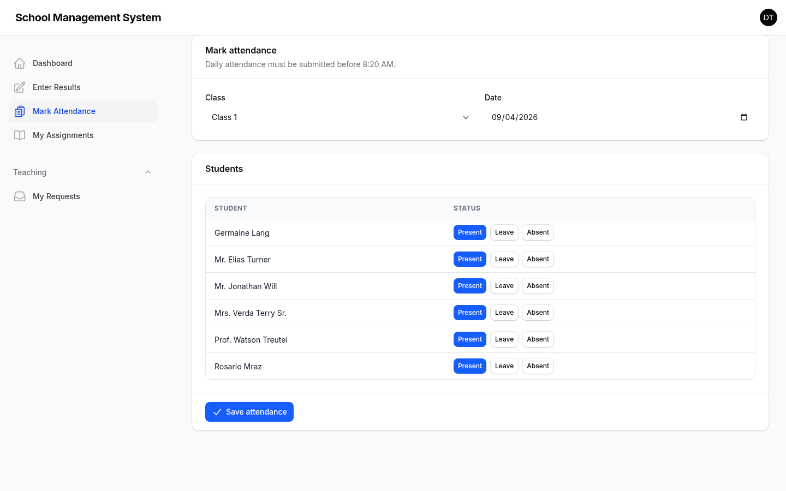
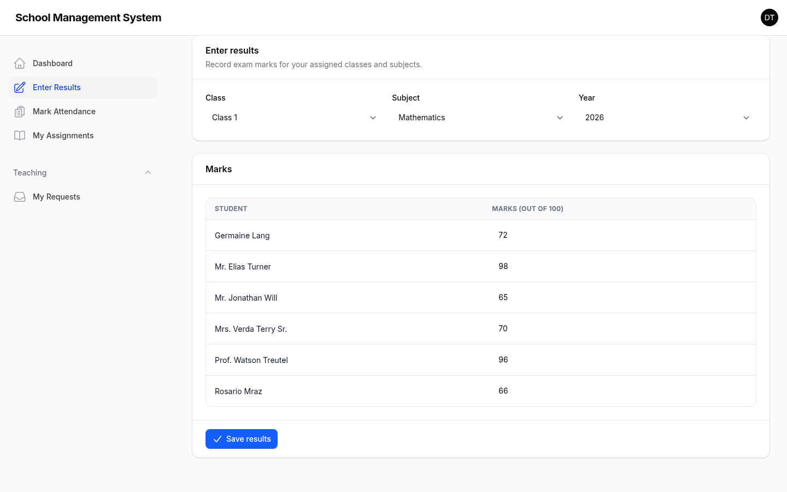
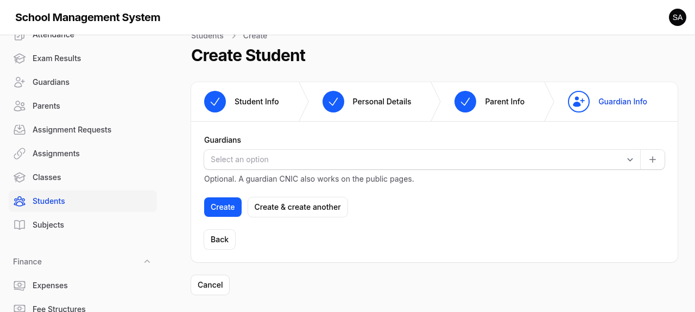

# School Management System

[](https://laravel.com)
[](https://www.php.net)
[](https://filamentphp.com)
[](https://livewire.laravel)
[](#testing)
[](LICENSE)

A complete school management system for **admins**, **teachers**, and
**parents** — two role-separated panels and a public portal that needs no
account at all. Built on [Laravel](https://laravel.com),
[Livewire](https://livewire.laravel), [Livewire Flux](https://fluxui.dev),
and [Filament v5](https://filamentphp.com), with custom views composed from
Filament components so every page shares one design system.

Repo: `shayanalibuilds/school-management-system`

## Screenshots

| Admin dashboard | Teacher dashboard |
| --- | --- |
|  |  |

| Mark attendance | Enter results |
| --- | --- |
|  |  |

| Students with bulk actions | Public results lookup |
| --- | --- |
|  |  |

| Public fees & online payment | Student creation wizard |
| --- | --- |
|  |  |

## Surfaces

| Who | Where | What |
| --- | --- | --- |
| Admins | `/dashboard` | Full control: academics, people, finance, HR, settings |
| Teachers | `/staff` | A focused workspace scoped to their own assignments |
| Parents | `/` | Public lookups for results, attendance, and fees — no login |

Every table across both panels ships **filters and bulk actions** (multi
edit, multi delete, multi status change), and every create/edit form is a
**step-by-step wizard** whose submit buttons appear only on the final step.

## Features

**Academics**
- Classes, subjects, and students (SR #, joining date, joining class, status)
- Student profiles created through a three-step wizard: student → parent → guardian
- Dedicated parents and guardians books, linked to students, CNIC-unique
- Staff directory with staff assignments (subject × class) and a change-request workflow

**Attendance**
- Daily attendance per class with present / late / absent states
- Automated 8:20 AM deadline check — admins are notified when attendance is missing

**Exams**
- Exam results per year and exam type with automatic grades and class positions
- Five-year performance analytics on the dashboard

**Finance**
- Fee structures, per-student fees, and partial payments
- Online payments via **EasyPaisa** and **JazzCash** with sandbox/live environments,
  encrypted credentials, and official receipts
- Payroll and expense tracking (admin only)

**People & tools**
- ID cards and staff cards, ready to print
- CSV import/export for students, staff, attendance, and exam results
- Gateway-agnostic payment settings guarded to admins

**Public portal**
- Parents look up records by **parent/guardian CNIC** or **student roll number (SR #)**,
  active students only
- Results (grades or class positions), 30-day attendance history, and fee dues
- Outstanding fees payable in-place through the configured gateway

**Scoped by role, by design**
- Teachers only ever see the classes and subjects assigned to them — the staff
  dashboard, attendance, and results entry are all filtered server-side (fail-closed)
- Finance operations and settings stay admin-only

## Getting started

**Requirements:** PHP 8.4 with `intl`, Composer, Node.js 22+, SQLite.

```bash
git clone https://github.com/shayanalibuilds/school-management-system.git
cd school-management-system

composer install
npm install

cp .env.example .env
php artisan key:generate

touch database/database.sqlite
php artisan migrate --seed

npm run build
php artisan serve
```

**Demo accounts** (seeded):

| Role | Email | Password |
| --- | --- | --- |
| Admin | `admin@school.test` | `password` |
| Teacher | `teacher@school.test` | `password` |

The seeder creates 10 classes, staff assignments, students, three years of
exam results, attendance history, and fee records — so every chart and lookup
has data on first run.

## Testing

The project follows test-first development and keeps the pipeline green:

```bash
php artisan test              # 115 tests, 420+ assertions
vendor/bin/pint --dirty       # code style
vendor/bin/phpstan analyse    # static analysis
```

## License

Released under the [MIT License](LICENSE).
